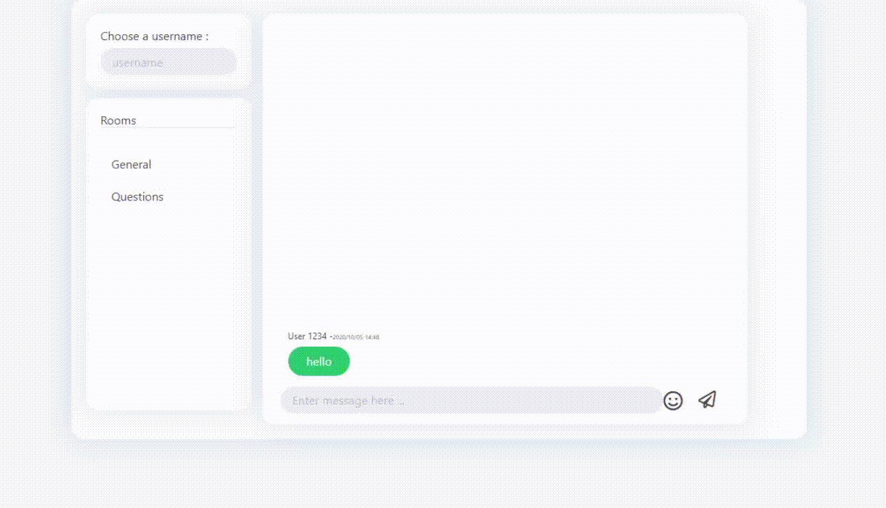

<!-- ABOUT THE PROJECT -->
## React-Messaging-App

> React-messaging-app is a front-end only messaging app made for fun !


### Demo




### Built With


* [Bulma](https://bulma.io/)
* [React](https://reactjs.org/)


### Installation


1. Clone the repo
   ```sh
   git clone https://github.com/Pinada/react-youtube-watch-time-gate.git
   ```
2. Install NPM packages
   ```sh
   npm install
   ```
3. Run
   ```sh
   npm start
   ```


<!-- LICENSE -->
## License

Distributed under the MIT License. See `LICENSE` for more information.


<!-- CONTACT -->
## Contact

Pinada - [@pinadaMedia](https://twitter.com/pinadaMedia) 


